# UPSTAY Website

> 업스테이(UPSTAY) — 리모델링 / 건물관리 / 임대관리 모바일 우선 마케팅 사이트

[](https://nextjs.org/)
[](https://www.typescriptlang.org/)
[](https://tailwindcss.com/)
[](https://www.sqlite.org/)
[](https://railway.app/)
[]()

---

## 📑 목차

- [개요](#-개요)
- [전체 아키텍처](#%EF%B8%8F-전체-아키텍처)
- [화면 구성](#-화면-구성-zone-매핑)
- [데이터 흐름](#-데이터-흐름)
- [데이터베이스 스키마](#%EF%B8%8F-데이터베이스-스키마)
- [기술 스택](#-기술-스택)
- [디렉토리 구조](#-디렉토리-구조)
- [설치 및 실행](#-설치-및-실행)
- [환경 변수](#-환경-변수)
- [Railway 배포](#-railway-배포)
- [보안](#-보안)
- [마이그레이션](#-마이그레이션)
- [테스트](#-테스트)
- [백업 / 복원](#-백업--복원)
- [교체 포인트](#-교체-포인트)
- [Zone 작업 규칙](#-zone-작업-규칙)

---

## 📖 개요

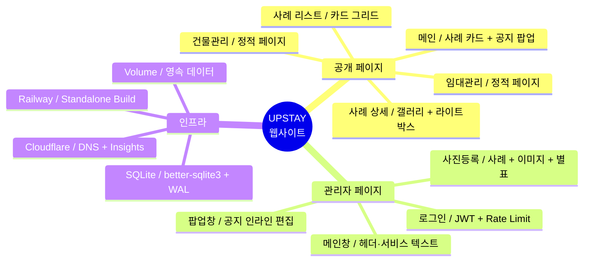

업스테이 사이트는 **외주 단일 개발자 환경**을 전제로 설계되었습니다.

- ✅ 빠른 데모 사이클 (force-dynamic + 60s ISR)
- ✅ 단일 SQLite + Volume mount (Postgres 불필요)
- ✅ 관리자가 텍스트/이미지/공지를 직접 편집
- ✅ 별표 시스템으로 메인 노출 4장 큐레이션

---

## 🏗️ 전체 아키텍처

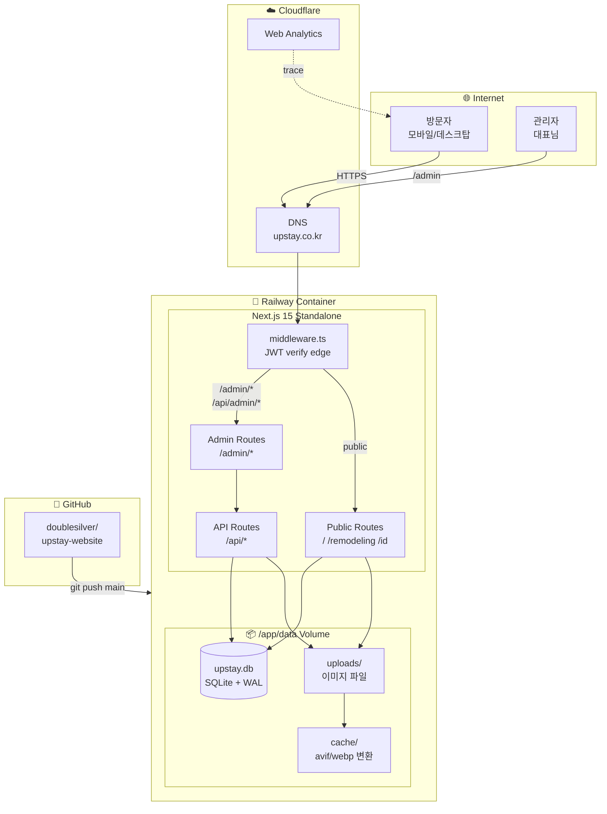

### 핵심 설계 결정

| 결정                                            | 이유                                                                   |
| ----------------------------------------------- | ---------------------------------------------------------------------- |
| SQLite + Volume mount                           | 외주 환경에서 Postgres 운영 부담 회피, 단일 admin이라 동시성 충돌 없음 |
| Standalone build                                | Docker 단일 이미지 + 빠른 cold start                                   |
| middleware JWT 검증                             | Defense-in-depth (라우트 핸들러 추가 검증)                             |
| `force-dynamic` (사례 리스트) + `revalidate=60` | admin 변경 즉시 반영 vs 캐시 효율 trade-off                            |

---

## 🗺️ 화면 구성 (Zone 매핑)

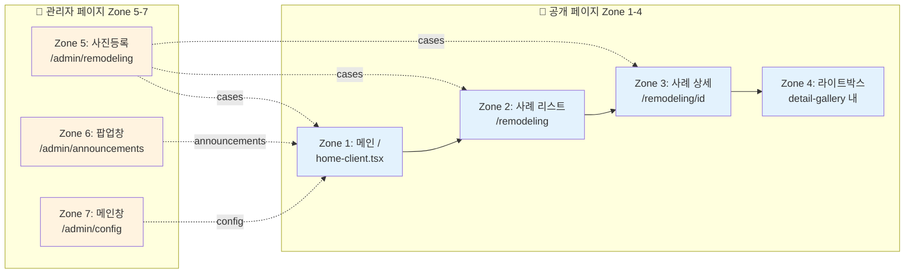

### 페이지별 상세

| Zone  | URL                    | 역할                                                   | 렌더링               | 주요 파일                                                                             |
| ----- | ---------------------- | ------------------------------------------------------ | -------------------- | ------------------------------------------------------------------------------------- |
| **1** | `/`                    | 메인 — 사례 카드 3개 + 서비스 섹션 + 공지 팝업         | revalidate 60s       | `app/page.tsx`<br/>`components/home-client.tsx`<br/>`components/service-sections.tsx` |
| **2** | `/remodeling`          | 사례 리스트 (전체보기 → 상세)                          | force-dynamic        | `app/remodeling/page.tsx`                                                             |
| **3** | `/remodeling/[id]`     | 사례 상세 — 갤러리 + 설명 박스                         | revalidate 60s + ISR | `app/remodeling/[id]/page.tsx`<br/>`detail-gallery.tsx`                               |
| **4** | (모달)                 | 라이트박스 — BEFORE/AFTER 동시 + 썸네일 strip          | client-side          | `LightboxColumn`, `LightboxThumbStrip`                                                |
| **5** | `/admin/remodeling`    | 사진등록 — 사례 CRUD + 이미지 + 별표(slot) + 편집 모달 | client-side          | `app/admin/remodeling/page.tsx`<br/>`components/admin/image-edit-modal.tsx`           |
| **6** | `/admin/announcements` | 팝업창 — 공지 인라인 편집 + B/· toolbar                | client-side          | `app/admin/announcements/page.tsx`                                                    |
| **7** | `/admin/config`        | 메인창 — 헤더/서비스/카테고리 텍스트 + 스타일          | client-side          | `app/admin/config/page.tsx`                                                           |

---

## 🔄 데이터 흐름

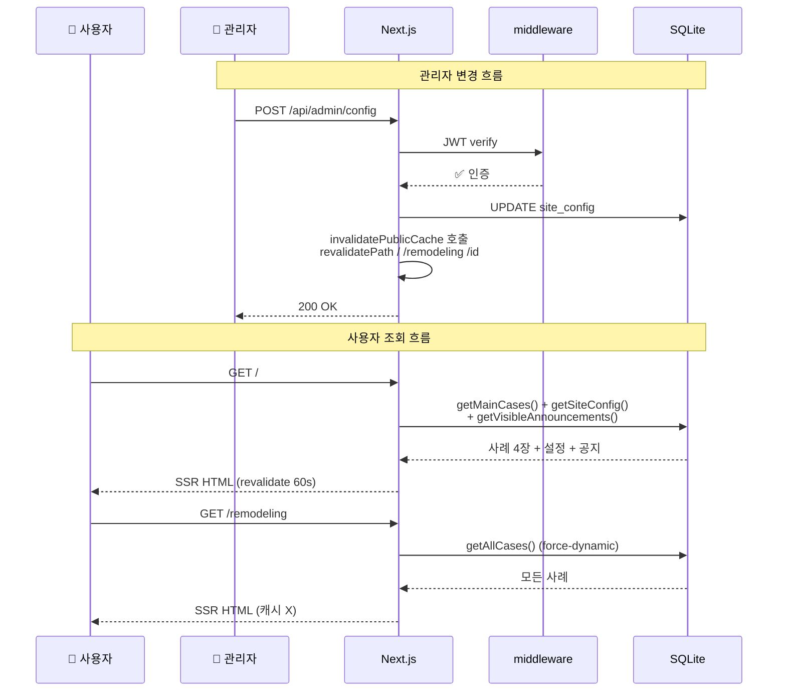

### 별표(slot_position) vs 드래그(match_order)

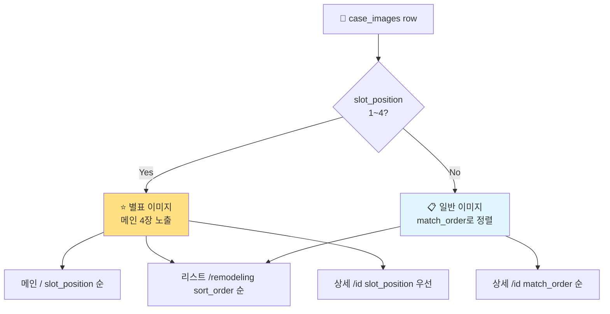

| 시스템                       | 영향 페이지             | 동작                                               |
| ---------------------------- | ----------------------- | -------------------------------------------------- |
| **별표 (slot_position 1~4)** | 메인 + 리스트 + 상세    | 메인은 별표만 노출, 다른 페이지는 별표가 항상 상단 |
| **드래그 (match_order)**     | 사례 상세 비별표 이미지 | 편집 모달 안에서만 드래그 (그리드 비활성)          |

---

## 🗄️ 데이터베이스 스키마

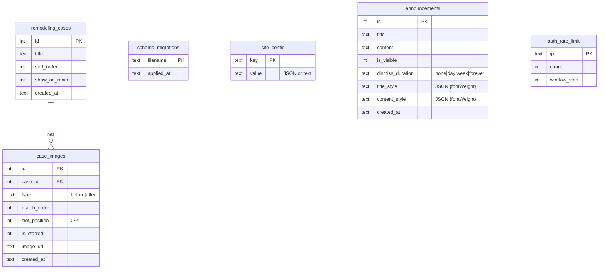

### 주요 테이블

| 테이블              | 행 수 (예상) | 핵심 컬럼                                   | 용도                                 |
| ------------------- | ------------ | ------------------------------------------- | ------------------------------------ |
| `remodeling_cases`  | ~10-30       | `title`, `show_on_main`                     | 리모델링 사례 메타                   |
| `case_images`       | ~50-200      | `slot_position`, `match_order`, `image_url` | 사례 이미지 + 정렬                   |
| `site_config`       | 60+          | `key`, `value` (JSON)                       | 헤더/서비스/카테고리 텍스트 + 스타일 |
| `announcements`     | ~5           | `title_style`, `content_style`              | 공지 팝업                            |
| `auth_rate_limit`   | 동적         | `ip`, `count`                               | 5분/5회 brute force 방어             |
| `schema_migrations` | 016+         | `filename`                                  | 자동 마이그레이션 트래커             |

---

## 🛠️ 기술 스택

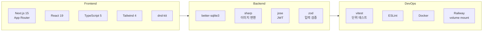

| 영역      | 라이브러리     | 버전 | 용도                 |
| --------- | -------------- | ---- | -------------------- |
| Framework | Next.js        | 15.5 | App Router, SSR, ISR |
| UI        | React          | 19.1 | 컴포넌트             |
| 스타일    | Tailwind CSS   | 4.x  | 유틸리티 클래스      |
| 폰트      | Pretendard     | CDN  | 한글 폰트            |
| DB        | better-sqlite3 | 12.9 | 동기 SQLite, WAL     |
| 이미지    | sharp          | 0.34 | avif/webp 변환       |
| 인증      | jose           | 6.x  | JWT (HS256)          |
| 검증      | zod            | 4.x  | 입력 schema          |
| DnD       | @dnd-kit       | 6.x  | 드래그 앤 드롭       |
| 아이콘    | lucide-react   | 1.x  | 아이콘               |
| 테스트    | vitest         | 4.x  | 단위 + 통합          |

---

## 📁 디렉토리 구조

```
upstay-website/
├── app/                          # Next.js App Router
│   ├── page.tsx                  # 메인 (Zone 1)
│   ├── layout.tsx                # 루트 레이아웃
│   ├── remodeling/
│   │   ├── page.tsx              # 사례 리스트 (Zone 2)
│   │   └── [id]/
│   │       ├── page.tsx          # 사례 상세 (Zone 3)
│   │       ├── layout.tsx
│   │       └── detail-gallery.tsx # + 라이트박스 (Zone 4)
│   ├── building-management/page.tsx
│   ├── rental-management/page.tsx
│   ├── admin/
│   │   ├── layout.tsx            # 사이드바 + 로그인 폼
│   │   ├── page.tsx              # 로그인
│   │   ├── remodeling/page.tsx   # 사진등록 (Zone 5)
│   │   ├── announcements/page.tsx# 팝업창 (Zone 6)
│   │   └── config/page.tsx       # 메인창 (Zone 7)
│   ├── api/
│   │   ├── auth/route.ts         # 로그인/로그아웃 + rate limit
│   │   ├── admin/
│   │   │   ├── config/route.ts
│   │   │   ├── announcements/route.ts
│   │   │   ├── remodeling/
│   │   │   │   ├── route.ts
│   │   │   │   └── images/
│   │   │   │       ├── route.ts
│   │   │   │       └── reorder/route.ts
│   │   │   └── upload/route.ts   # 이미지 업로드 + magic number
│   │   └── uploads/[...path]/route.ts # 서빙 + path traversal 방어
│   └── sitemap.xml/route.ts
├── components/
│   ├── home-client.tsx           # 메인 client 컴포넌트
│   ├── service-sections.tsx      # 안내 카테고리 5개
│   ├── announcement-popup.tsx    # 공지 모달
│   ├── header.tsx, footer.tsx
│   ├── kakao-button.tsx          # 카카오톡 친구추가 모달
│   ├── protected-image.tsx       # 우클릭 차단 + lazy
│   ├── container.tsx
│   └── admin/
│       ├── image-edit-modal.tsx  # 이미지 편집 + 썸네일 DnD
│       └── toast.tsx
├── lib/
│   ├── db/
│   │   ├── index.ts              # getDb() + applyMigrations()
│   │   └── migrations/
│   │       ├── 001_add_star_field.sql
│   │       ├── ...
│   │       └── 016_drop_image_url_wm.sql
│   ├── home-data.ts              # buildCases / getMainCases / getAllCases
│   ├── config-schema.ts          # CONFIG_ENTRIES + zod
│   ├── admin-schemas.ts          # 이미지/공지 zod
│   ├── admin-api.ts              # apiFetch + headers
│   ├── auth.ts                   # JWT + timing-safe credential
│   ├── cache.ts                  # invalidatePublicCache()
│   ├── text-style.ts             # parseStyle / styleToCss (XSS whitelist)
│   ├── paths.ts                  # DATA_DIR / UPLOAD_DIR
│   └── shimmer.ts                # blur placeholder
├── middleware.ts                 # /admin/* + /api/admin/* JWT 검증
├── public/
│   ├── logo.svg                  # 헤더/로그인 로고
│   ├── icon-kakao.png
│   ├── icon-phone.png
│   └── ...
├── data/                         # ⚠️ .gitignore (volume mount)
│   ├── upstay.db
│   ├── uploads/
│   └── cache/
├── tests/                        # vitest
├── scripts/                      # 백업
├── WORK_ZONES.md                 # Zone 작업 규칙
├── CHANGES.md                    # 변경 로그
├── QUESTIONS.md                  # 클라이언트 확인 사항
├── Dockerfile
├── railway.json
└── README.md
```

---

## 🚀 설치 및 실행

### 사전 요구사항

- Node.js **20+**
- npm **10+**

### 설치

```bash
git clone https://github.com/doublesilver/upstay-website.git
cd upstay-website
npm install
cp .env.example .env.local  # 환경변수 설정 (아래 참고)
```

### 개발 서버

```bash
npm run dev
# → http://localhost:3000
```

### 프로덕션 빌드

```bash
npm run build
npm start
```

---

## 🔑 환경 변수

`.env.local` 또는 Railway Environment Variables에 설정:

| 키           | 필수 | 기본값   | 설명                                                          |
| ------------ | ---- | -------- | ------------------------------------------------------------- |
| `ADMIN_ID`   | ✅   | -        | 관리자 아이디                                                 |
| `ADMIN_PW`   | ✅   | -        | 관리자 비밀번호 (개인 사이트라 짧게 OK + rate limit으로 방어) |
| `JWT_SECRET` | ✅   | -        | JWT 서명 키 (**32자 이상**)                                   |
| `DATA_DIR`   | ⚪   | `./data` | DB + 업로드 저장소                                            |
| `SEED_DEMO`  | ⚪   | -        | `1`이면 데모 데이터 시드                                      |

### JWT_SECRET 생성

```bash
node -e "console.log(require('crypto').randomBytes(32).toString('hex'))"
# → 64자 hex string
```

### 보안 권고

> ⚠️ `JWT_SECRET`은 한 번 노출되면 모든 admin 토큰 위조 가능. Railway env에만 보관, git history에 commit 금지.

---

## 🚂 Railway 배포

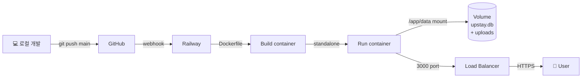

### 배포 체크리스트

1. **GitHub 연결**: Railway dashboard에서 `doublesilver/upstay-website` 연결
2. **Environment Variables**: `ADMIN_ID`, `ADMIN_PW`, `JWT_SECRET` 설정
3. **Volume mount**:
   - Service → Settings → Volumes
   - Mount path: `/app/data`
   - Size: 1GB
4. **자동 배포**: `git push origin main` → Railway 자동 빌드+배포

### CLI 방식

```bash
railway login
railway link  # 프로젝트 연결
railway variables --set "ADMIN_ID=upstay" --set "ADMIN_PW=0426" \
                  --set "JWT_SECRET=$(openssl rand -hex 32)"
railway redeploy -y
```

---

## 🛡️ 보안

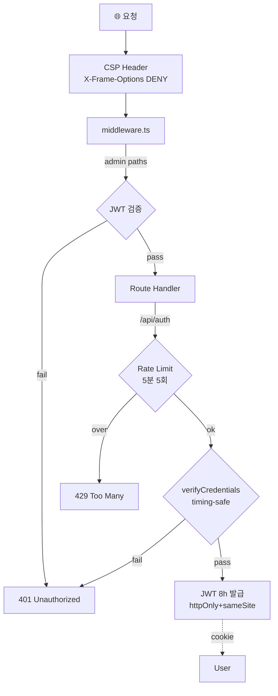

### 적용 항목

| 항목                   | 적용                                                |
| ---------------------- | --------------------------------------------------- |
| HttpOnly 쿠키          | ✅ JWT 토큰                                         |
| SameSite=strict        | ✅ CSRF 방어                                        |
| Secure                 | ✅ production만                                     |
| JWT 8h 만료            | ✅                                                  |
| Timing-safe credential | ✅ ID 추측 방어                                     |
| Rate limit             | ✅ 5분/5회 (auth_rate_limit + 자동 cleanup)         |
| IP 위조 방어           | ✅ x-real-ip 우선, x-forwarded-for rightmost        |
| Path traversal         | ✅ `startsWith(UPLOAD_DIR + sep)` + ext whitelist   |
| 이미지 magic number    | ✅ JPEG/PNG/WebP/GIF 시그니처 검증                  |
| 입력 검증              | ✅ zod schema 모든 admin API                        |
| XSS 방어               | ✅ `text-style.ts` fontSize/fontWeight 화이트리스트 |
| CSP                    | ✅ X-Frame-Options DENY, nosniff                    |
| middleware 보호        | ✅ `/admin/*` + `/api/admin/*`                      |

---

## 📜 마이그레이션

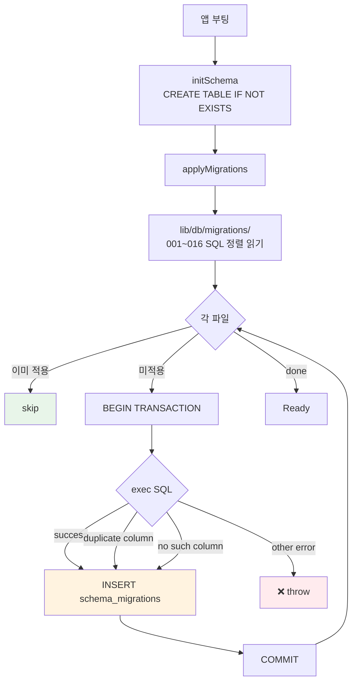

### 자동 멱등성 가드

```typescript
// lib/db/index.ts
catch (e) {
  const msg = String(e);
  if (msg.includes("duplicate column") ||  // ADD COLUMN 이미 있음
      msg.includes("no such column"))      // DROP COLUMN 이미 없음
  {
    // skip — schema_migrations 기록만
  } else throw e;
}
```

### 마이그레이션 추가

1. `lib/db/migrations/017_feature.sql` 생성
2. SQL 작성 (ALTER TABLE 형태 권장):
   ```sql
   ALTER TABLE remodeling_cases ADD COLUMN new_field TEXT NOT NULL DEFAULT '';
   ```
3. 앱 재시작 → 자동 적용

> 💡 **베스트 프랙티스**: `CREATE TABLE`은 절대 변경하지 말 것. 새 컬럼은 ALTER 마이그레이션 단독으로 추가. fresh DB와 production DB 모두 정상 동작.

### 현재 마이그레이션 (16개)

```
001_add_star_field.sql              ─ slot_position 별표
002_add_category4_and_visibility.sql─ 안내 카테고리 (4) + 노출 토글
003_add_photo_guide_config.sql      ─ 사진안내 카테고리 config
004_add_dismiss_duration.sql        ─ 공지 dismiss 옵션
005_split_category4_style.sql       ─ title_style/desc_style 분리
006_show_on_main_unique.sql         ─ 메인 노출 슬롯 1~3 unique
007_starred_partial_index.sql       ─ 별표 partial index
...
013_auth_rate_limit.sql             ─ 로그인 rate limit 테이블
014_add_announcement_styles.sql     ─ 공지 fontWeight style 컬럼
015_strip_legacy_bold_markers.sql   ─ ** 마크다운 → fontWeight 마이그레이션
016_drop_image_url_wm.sql           ─ 워터마크 컬럼 폐기
```

---

## 🧪 테스트

```bash
npm test           # 단발 실행 (vitest)
npm run test:watch # 감시 모드
```

| 영역                          | 커버리지 |
| ----------------------------- | -------- |
| 사진 순서 변경 (UNIQUE 우회)  | ✅       |
| 별표 4장 서버 제한            | ✅       |
| 메인 노출 필터                | ✅       |
| `/api/uploads` path traversal | ✅       |
| 이미지 magic number           | ✅       |
| `verifyToken` 만료/조작       | ✅       |
| reorder 트랜잭션 원자성       | ✅       |
| 마이그레이션 멱등성           | ✅       |

---

## 💾 백업 / 복원

### 수동 백업

```bash
npm run backup
# 기본: ~/upstay-backups/upstay-YYYYMMDD-HHMMSS.tar.gz
# 환경변수: UPSTAY_BACKUP_DIR=/path npm run backup
# 자동 정리: 14개 초과 시 오래된 백업 삭제
```

### 자동 백업 (macOS launchd)

```bash
cp scripts/com.upstay.backup.plist.example ~/Library/LaunchAgents/com.upstay.backup.plist
sed -i '' "s|USER_HOME|$HOME|g; s|PROJECT_PATH|$(pwd)|g" \
  ~/Library/LaunchAgents/com.upstay.backup.plist
launchctl load ~/Library/LaunchAgents/com.upstay.backup.plist
# 매일 03:00 자동 실행
```

### 복원

```bash
tar xzf ~/upstay-backups/upstay-20260428-030000.tar.gz
# data/ 디렉토리 추출
# Railway: railway ssh + scp로 /app/data에 업로드
```

---

## 🔧 교체 포인트

### 카카오톡 ID

`components/kakao-button.tsx`의 `KAKAO_ID` 상수:

```typescript
const KAKAO_ID = "mh.0624";
```

### 사업자 정보

`lib/site.ts` 또는 `/admin/config` 화면에서 직접 편집:

- 사명, 대표자, 주소, 사업자등록번호, 전화번호

### 로고 / 워터마크

```bash
public/logo.svg       # 헤더/관리자 로그인 로고
public/watermark.svg  # (현재 미사용 — v3.10에서 워터마크 시스템 폐기)
```

> Adobe Illustrator → `File → Export As... → SVG` 로 내보낸 파일을 위 경로에 덮어쓰기.

---

## 📐 Zone 작업 규칙

자세한 내용: [`WORK_ZONES.md`](./WORK_ZONES.md)

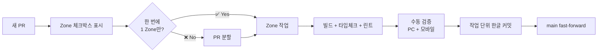

### 핵심 규칙

1. **한 번에 1 Zone만 수정**
2. **커밋 메시지에 zone 명시**: `fix(zone-2): ...`
3. **공용 모듈 변경 시 전체 회귀 테스트**
4. **DB 변경은 마이그레이션 SQL만** (CREATE TABLE 변경 금지)
5. **외주 단일 개발자 환경 — 과도한 추상화 금지**

---

## 📋 라이선스

프라이빗 프로젝트 (비공개).

---

## 📞 문의

- **개발자**: [@doublesilver](https://github.com/doublesilver)
- **클라이언트**: 업스테이 (대표 이동훈)
- **카카오톡**: `mh.0624`
- **사이트**: [upstay.co.kr](https://upstay.co.kr)
